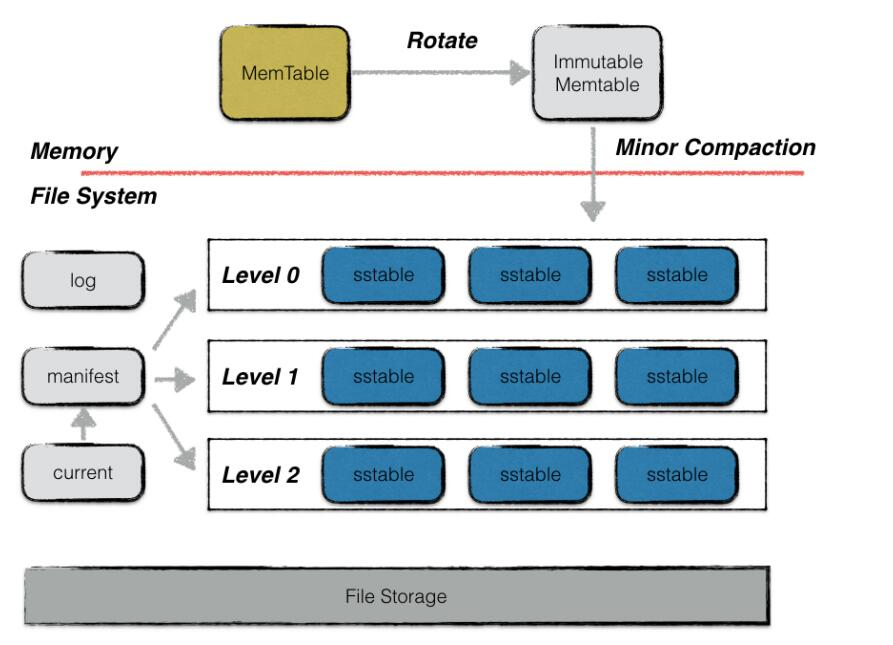
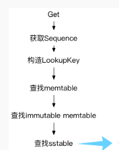

# 设计思路

## 背景

LevelDB结构如下。

LevelDB的写先写入内存的memtable。当内存中的memtable达到一定大小时转化成immutable memtable，并触发minor compaction，将immutable memtable的内容刷写到磁盘。

LevelDB的读依次访问内存中memtable和immutable，如果都不命中，然后再访问磁盘上的L0~L6.

## 思路

我们需要将LevelDB的L0~L6替换成已经实现的ComboTree，其他结构保持不变。要保持LevelDB的正常运行，需要修改对应读写的代码。

### 写逻辑的修改

写需要修改的是Minor Compaction的部分。当出发Minor Compaction的时候，将immutable Memetable中的内容写入到ComboTree中，而不是转换成L0~L2的文件。

LevelDB自身的Compaction由单线程进行操作。由于ComboTree支持并行访问，所以对immutable memtable的内容，按照key范围划分，由不同的线程进行并行插入。

### 读逻辑的修改

读需要修改的是在查找sstable的部分，将查找sstable的代码替换成在ComboTree中查找。
