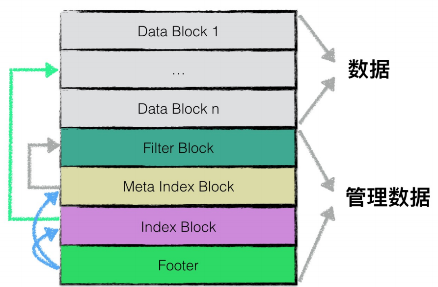
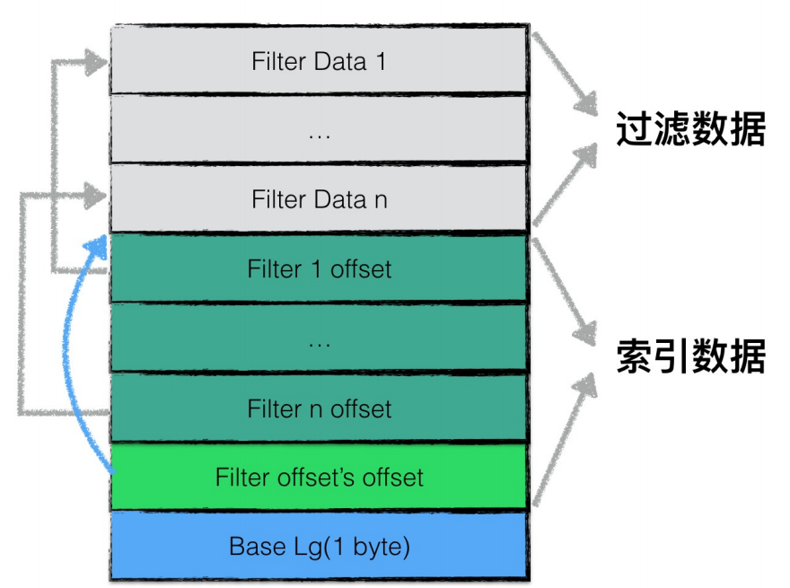

# 1. Table

阅读Table文件夹中关于sstable实现的有关内容。

在[overview](./overview.md)中已经描述过了table的大致结构。

从Table.h中可以知道，table结构中只有一个Rep结构。

## 1.1. Rep结构

从table.cc文件中可以看到Rep结构的定义：

1. options Options 构建Table的参数
2. status Status 状态
3. file RandomAccessFile* 对应的文件
4. cache_id uint64_t
5. filter FilterBlockReader* filterblock
6. filter_data const char* filter的数据部分
7. metaindex_handle BlockHandle metaindexblock部分
8. index_block Block* index block部分

之前已经提到过一个table的组成如下：

可以看到大致的对应逻辑。接下来先一次看Rep中使用到和block相关的结构。

### 1.1.1. FilterBlockReader

结构的定义在filter_block.h中。拥有的成员变量有：

1. policy_  FilterPolicy* 这个结构在include/levelddb/filter_policy.h中，描述filter_policy的内容。
2. data_ const char* filter block的数据起始地址
3. offset_ const char* filter block中offset段的起始地址
4. num_ size_t filter block中的项数
5. base_lg_ 编码参数

filter_block的结构如下：

### 1.1.2. BlockHandle

定义在format.h中。

1. offset_ uint64_t
2. size_ uint64_t

这个结构单纯的用来指向一个block。

### 1.1.3. Block

定义在block.h中。

1. data_ const char*
2. size_ size_t
3. restart_offset_ uint32_t
4. owned_ bool

暂时看不出来这个结构的用处。

> 在看完了Rep结构中成员变量对应的结构，接下来看table和Rep对应的成员函数。

### 1.1.4. Open

这个函数是用来从一个RandomAccessFile打开一个table的。这里出现了新的结构Footer和BlockContents，先看一下。

#### 1.1.4.1. Footer

Footer的定义在format.h中。

1. metaindex_handle_ BlockHandle
2. index_handle_ BlockHandle
3. KEncodeLength 编码用的魔数

可以看到这个结构只包含指向metaindex block和index block的两个BlockHandle，和之前给出的结构一致。

#### 1.1.4.2. BlockContents

BlockContents的定义也在format.h中。

1. data Slice 指向数据
2. cachable bool 是否缓存
3. heap_allocated bool 调用者是否需要手动delete

open函数先读取Footer结构。然后根据Footer指明的index_handle读取index block。然后用读取的footer和index block来构造Rep和table。这里filter block相关的信息都为空。filter相关的内容通过ReadMeta函数从传入的options参数和footer的metaindex中读取出来。

### 1.1.5. ReadMeta

ReadMeta用来从传给open的options参数和footer的metaindex中来读取filter相关的数据。

这个函数中出现了迭代器的使用，之前没看过迭代器的具体实现，这里正好看一下这个迭代器。

#### 1.1.5.1. Block::Iter

在block.cc中定义。

1. comparator_ Comparator* 比较器
2. data_ const char* 数据段
3. restarts_ restart points
4. num_restarts_ 重启点数目 
5. current_ 当前offset
6. restart_index_ 当前处在的restart区间
7. key_ 当前的key
8. value_ 当前的value

具体的函数就不用分析了，就是在data段不断向后访问，比较直接。

> 问题：open函数中并没有设置当前table的rep_，而是在设置传入的table参数。那么说明这个函数调用方是一个已经设置好的table?否则ReadMeta的rep_变得毫无意义。
> 这里就先略去迭代器的函数部分。真的太复杂了。

> 后来想明白了，是对table调用了ReadMeta函数，所以没有问题。还是在设置table参数。

### 1.1.6. ReadFilter

根据传入的指向filter block的slice来读取filter block并写入rep_中。

### 1.1.7. DeleteBlock

感觉是要删除一个Block，但是对如interpret_cast不了解，所以停下来看一看。

> reinterpret_cast 就是强转指针类型，不知道为什么要调用这个。

## 1.2. block_builder

> 和table_builder是两个类，不要弄混了。

1. options_ Options 构造的参数
2. buffer_ string 缓存区
3. restarts_ vector<uint32_t> 记录每个restart pointer的偏移
4. counter_ 记录在上一个restart pointer后又有几个entry了。
5. finished 标识写入是否结束了。
6. last_key_ 当前block的最后一个key(最大的key)

