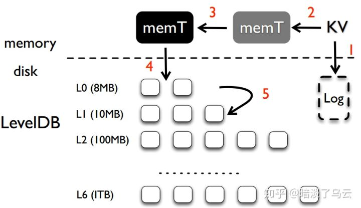
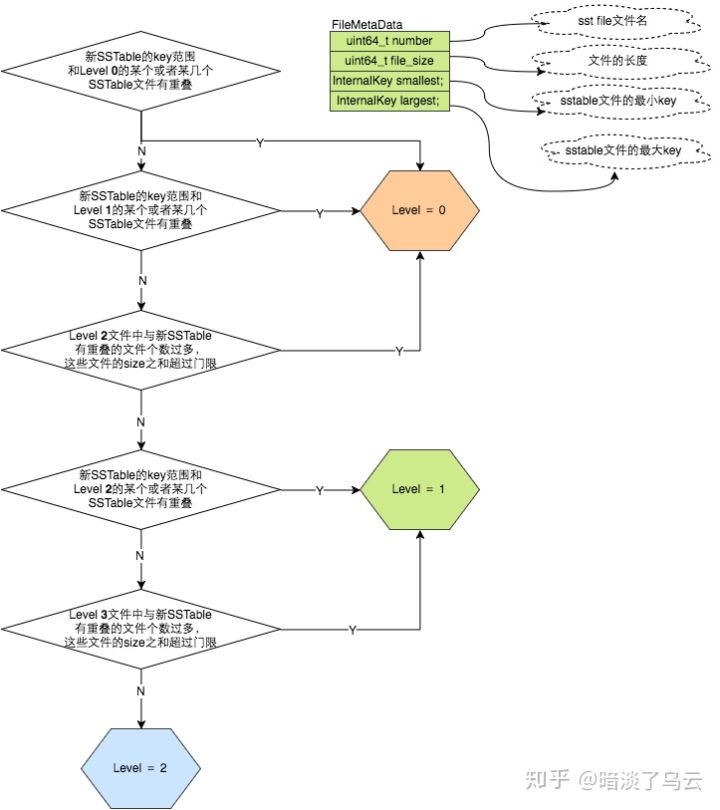
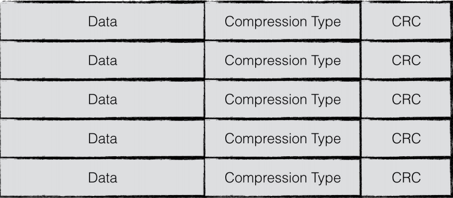
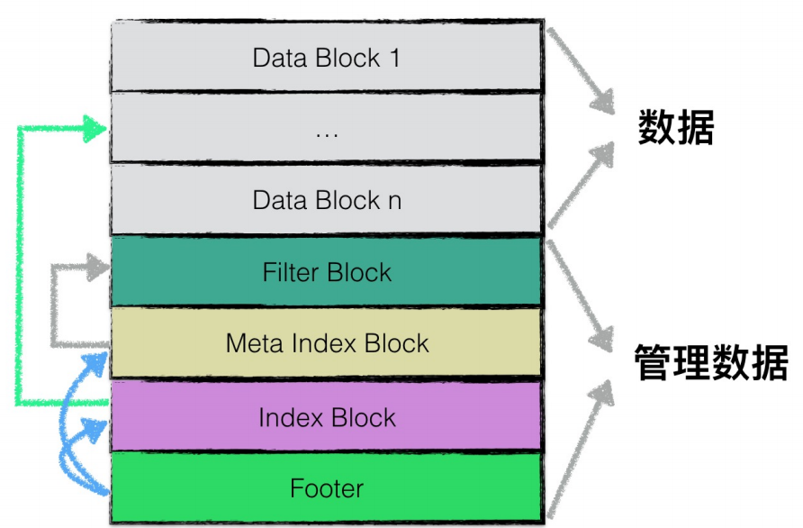
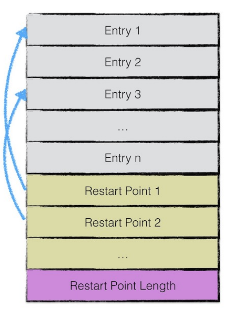
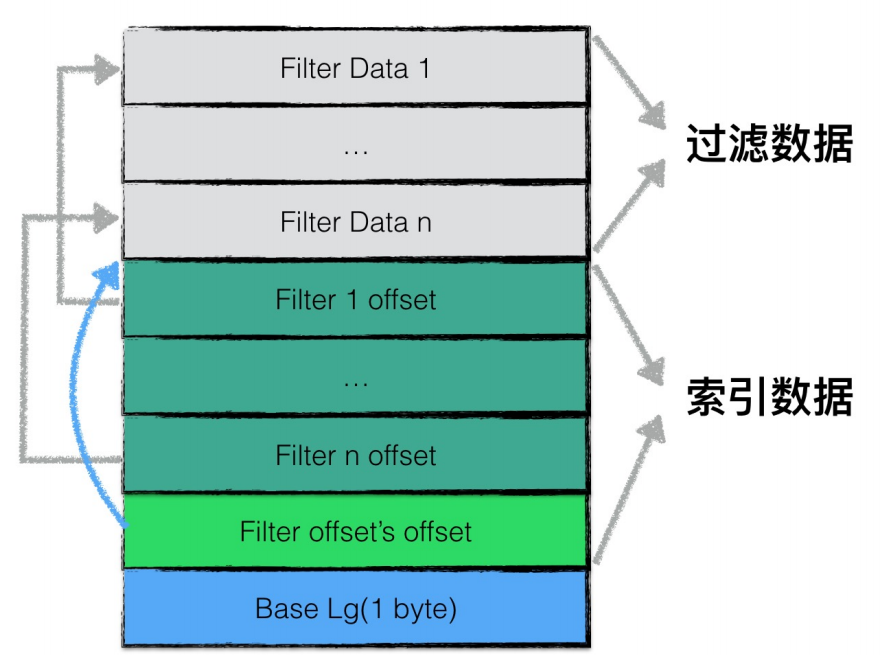
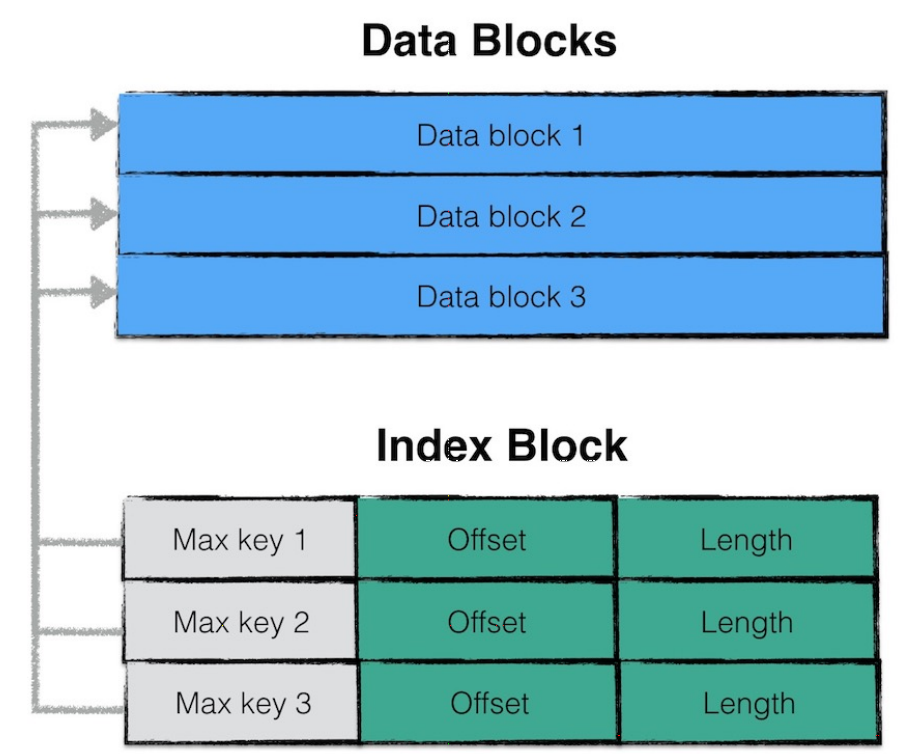
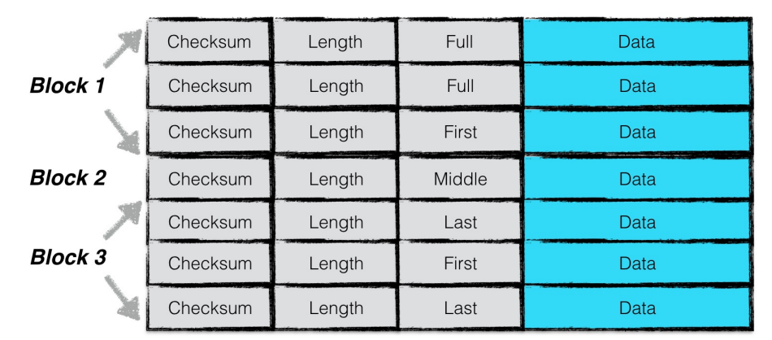

# README.md

大致介绍了LevelDb。包括它的性能和大致使用。对我主要有用的是最后一节Repository contents.介绍了主要的介绍文档和LevelDb的主要模块以及对应的文件。让我有了一个开始看的方向。

主要有：

* doc/index.md **leveldb库用法描述**
* doc/impl.md **leveldb实现的简单描述**
* include/leveldb/*.h **leveldb的接口**

leveldb的主要模块包括：

* db
* options
* comparator
* iterator
* write_batch
* slice
* status
* env
* table

## index.md

这一部分介绍了levelDb库的基本用法，从外部接口上描述了levelDb。LevelDb基本用法和涉及到的数据结构包括：

1. open db
2. check db status
3. close db
4. reads and writes
5. atomic updates (WriteBatch)
6. synchronous writes (WriteOptions)
7. concurrency (iteration and WriteBatch needs extern synchroniztion)
8. iteration
9. snapshots
10. slice
11. comparators
12. backwards compatibility (the name of comparator must keep consist although the structure of key and comparator stay changing)
13. performance (adjust paramater)
    * block size (adjacent keys are organized in adjacent or the same block.Change block size for the need of read )
    * compression (set option.compression kNoCompression if it's needed )
    * cache (choose the size of option.block_cache according to read performance)
    * key layout (add extra charater to keys to acheive your access need)

14. filter (bloomfilter:reduce disk reads)
15. checksum
16. approximate sizes (range)
17. env
18. port

这些的基本用法的代码和详细解释[index.md](https://github.com/minxinhao/leveldb/blob/master/doc/index.md)中已经给出了，我就不重复了。

    到基本目前为止只看了leveldb的库接口的设计和基本用法，后续要继续看底层的实现。

## impl.md

介绍了leveldb的实现模型。主要是数据按新旧存放在不同文件中，然后文件按层存放的格式和compation操作。阅读的主要障碍还是compaction。

leveldb主要的文件格式如下图：



leveldb的文件包括：

* .log 用来记录最近的更新。当log的大小达到4MB，log的数据被转换成一个sorted table来存储。然后新建一个.log文件来记录后续的更新
* memtable 当前.log文件在内存中的备份
* sorted tables 每个sorted table一系列的entry，这些enrey存储(k,v)对，并且按照key排序。这些sorted table被组织成层次结构。
* manifest 列出组成组成每一层的sorted tables，对应的key范围以及其他元数据。每次数据库被打开的时候都会新建一个manifest文件。
* current 标识最近的一个manifest文件
* log.old info logs
* others

### Level 0的生成

当.log达到一定大小后，创建一个新的memtable和.log文件，后续的更新将写入这个文件。在后台则进行：

* 将旧的memtable内容写入一个sstable，这就是level 0(这其实也是一个compaction，后续会讲到，而且新生成的sstable也不一定是level 0)。
* 删除旧的log文件和memtable

### Compaction

这里简单的讲述了compaction的大致流程。我还没看到具体实现的代码，参考[一篇博客](https://zhuanlan.zhihu.com/p/46718964),讲解的很详细，但不知道是否正确。

当L层的大小超过对应的限制后，将会在后台进行compact操作。将会挑选一个L层的文件和L+1层中所有key范围有交集的文件进行合并，生成一系列新的L+1层文件。第0层的文件会单独考虑。新生成的L+1文件在大小和key范围上有限制，来避免后续的compact过程中要操作过多的文件。compact完成后，旧文件会被忽略掉，而新文件会被加入manifest中。

compact中每一层具体的限制和挑选文件的规则链接的博客中有详细的解释。

#### Compaction的种类

Compaction大致分为两种：

1. Minor Compaction 将memtable持久化为sstable
2. Major Compaction 相邻两层之间sst的合并
    * Manual Compaction 人工触发，外部接口调用产生，如ceph中的Compaction
    * Size Compaction 每个level的大小达到上限触发
    * Seek Compaction 每个文件的seek miss有一个上限，超过后对文件进行compact

这些Compaction的优先级：Minor>Manual>Size>Seek.
LevelDb在MayBeScheduleCompaction的Compaction调度函数中来对各种Compaction进行调度。

#### Minor Compaction

Minor Compaction用来将memtable持久化为sstable。在write新数据进入leveldb的时候触发，会定期检查memtable占用内存的大小，一旦超过options_.write_buffer_size(default 4M),就会尝试Minor Compaction。

新产生出来的sstable并不一定处于level 0，尽管大多数情况下(在DB运行一段时间后)处于level 0。具体的判断由PickLevelForMemTableOutput函数来计算。PickLevelForMemTableOutput的逻辑如下图：



可以看到主要的逻辑是：跟新产生的sstable和0~2层的sstable的重叠程度，将这个sstable放在尽可能高的层。这样也是为了优化读效率，因为新产生的sstable最近可能被再次访问。否则将这个sstable推往尽可能高的层，这里有一个控制参数：KMaxMemCompactLevel(defualt 2)。

#### Major Compaction

Major Compaction将不同层的sst进行合并，目的是：

* 控制每一层的大小，保证read性能
* 合并update和delete，回收空间

Major Compaction分为三种：Manual,Size,Seek。LevelDb自己运行的时候不会调用Manual，而Size和Seek的关系为：

```c++
if (size_compaction) {
    //
} else if (seek_compaction) {
    //
} else {
    return NULL;
}
```

##### Manul Compaction

Manual Compation在levelDB的内部并不会触发，只有在外部调用 void DBImpl::CompactRange(const Slice begin, const Slice end)接口时才会触发，

Manul Compaction的核心过程如下：

第1步：遍历level 0到level 6：如果level i存在sst文件和begin和end重合，那么就更新max_level_with_files = level;

第2步：

    for (int level = 0; level < max_level_with_files; level++) {
        TEST_CompactRange(level, begin, end);
    }

其中TEST_CompactRange(level, begin, end);将慢慢的Compact掉整个level中所有与begin和end存在重叠（overlap）的sst文件。当 begin 和 end 为NULL时，表示尝试 Compact 所有的文件。

##### Size Compaction

Size Compaction是levelDB的核心Compact过程，其主要是为了均衡各个level的数据， 从而保证读写的性能均衡。

**Size Compaction 执行条件:**

levelDB会计算每个level的总的文件大小，并根据此计算出一个score，最后会根据这个score来选择合适level和文件进行Compact. 具体的计算方式如下：

对level 0：文件个数阈值kL0_CompactionTrigger = 4，则：

score = level 0的文件总数 / 4

对其他的level，每个level所有文件的总大小的一个阈值：

第0层： 10M（level 0可以忽略，其采用的是文件个数计算score）

第1层： 10M

第2层： 100M

第3层： 1000M （ 1G）

第4层： 100000M （ 10G）

第5层： 1000000M （ 100G）

Level 6就不用算了，它已经是最高的层级了，不会存在Compact了。

​
如果超过这个值，那么：

score = 整个level所有的file size总和 / 此level的阈值

​ 我们会选择score最大的level并做标记。会在合适的时机触发。

**核心过程**

第1步：计算的score值，可以得出 max score，从而得出了应该哪一个 level 上进行 Compact，

第2步：假设上面选出的是 level n，那么第 2 步就是选择出需要 Compact 的文件，其包含两步，首先在 level n 中选出需要 Compact 的文件文件（对应第2.1步）；然后根据level n选出的文件的key的begin和end来选出 level n+1 层的 sst 文件（对应第2.2步）：

​ 第2.1步：确定level n参与Compact的文件列表

​ 2.1.1: 将begin key更新为level n 上次Compact操作的文件的largest key。然后顺序查找level的sst文件，返回第一个largest key > begin key的sst文件，并加入到level n需要Compact的文件列表中；

2.1.2: 如果是n==0，把sst文件都检查一遍，如果存在重叠则加入Compact文件列表中。因为level 0中，所有的文件之间都有可能存在重叠（overlap）。

​ 第2.2步：确定level n+1参与Compact的文件列表；

​ 2.2.1: 计算出level n参与Compact的文件列表的所有sst文件的总和key范围的begin和end；

​ 2.2.2: 根据2.2.1计算出来的begin和end，去获取根level n+1有重叠（overlap）的sst文件列表；

​ 2.2.3: 计算当前的level n 和 n+1参与Compact的两个文件列表的总和，如果小于阈值kExpandedCompactionByteSizeLimit=50M，那么会继续尝试在level n中选择出合适的sst文件，考虑到不影响理解，具体细节暂时省略。

##### Seek Compaction

在levelDB中，每一个新的sst文件，都有一个 allowed_seek 的初始阈值，表示最多容忍 seek miss 多少次，每个调用 Get seek miss 的时候，就会执行减1（allowed_seek--）。其中 allowed_seek 的初始阈值的计算方式为：

```c++
allowed_seeks = (sst文件的file size / 16384);  // 16348——16kb
if ( allowed_seeks < 100 )
    allowed_seeks = 100;
```

LevelDB认为如果一个 sst 文件在 level i 中总是没找到，而是在 level i+1 中找到，那么当这种 seek miss 积累到一定次数之后，就考虑将其从 level i 中合并到 level i+1 中，这样可以避免不必要的 seek miss 消耗 read I/O。当然在引入布隆过滤器后，这种查找消耗的 IO 就会变小很多。

**执行条件**

当 allowed_seeks 递减到小于0了，那么将标记为需要Compact的文件。但是由于Size Compaction的优先级高于Seek Compaction，所以在不存在Size Compaction的时候，且触发了Compaction，那么Seek Compaction就能执行。

**核心过程**

计算 sst 的 allowed_seek 都是在 sst 刚开始新建的时候完成；而每次 Get（key）操作都会更新 allowed_seek，当allowed_seeks 递减到小于0了，那么将标记为需要 Compact 的文件。

### Compaction带来的时间开销

0层的Compact单独考虑：

0层的Compact最多读取4个0层sst和10个1层的sst，总IO是read 14M和write 14M。

一般情况下L层文件的Compact:

每层=层文件自身大小上限2MB。L层读取一个sst，L+1层最多读取10个加2个(为了对齐的额外开销)个sst，一共13个sst。也就是read 26M和write 26M。

为了减少Compact带来的额外开销，有以下对措：

* 增大.log文件持久化为0层sst的阀值。代价是内存开销变大
* 减少写入
* 将未压缩的0层文件保存在cache中

### 文件数目

在文件大小和文件数目之间做均衡。文件数目过多的时候会减慢文件系统打开目录中文件的速度。

### 故障回复

故障回复的主要步骤是：

1. Read CURRENT to find name of the latest committed MANIFEST
2. Read the named MANIFEST file
3. Clean up stale files
4. We could open all sstables here, but it is probably better to be lazy...
5. Convert log chunk to a new level-0 sstable
6. Start directing new writes to a new log file with recovered sequence#

### 垃圾回收

DeleteObsoleteFiles()函数进行垃圾回收。它在compact和recovery完成后被调用。它会删除：

* 非当前使用的.log文件
* 没有被任何层引用且不是compact目标输出的sst文件

## table_format.md

table_format.md描述了leveldb中文件的格式，也就是持久化内存中每一层sstable的存储格式。这一部分中也阅读了源码table/block_builder.h,table/block_builder.cc(sstable中数据分块存储，这两个文件描述一个block的结构)，include/leveldb/slice.h(leveldb的指针结构),include/leveldb/fiter_policy.h(bloom过滤器的模板)。也参看了[一篇博客](https://github.com/minxinhao/read_and_analyse_levelDB/blob/master/reference/leveldb-handbook.pdf)，讲解是stable的结构。

### varint

leveldb中的数据使用protocbuf中的编码格式。这里主要是[varint](https://developers.google.com/protocol-buffers/docs/encoding#varints)。

varint的编码格式比较简单，采用小端编码(little_end)。除了最后一个byte，其他每个byte中第一位（最高位）代表是否结束，其他七位为信息为。越往后出现的byte是高位。计算的时候用最后一个byte连接前面byte的后七位就得到实际值。

### slice.h

slice是leveldb内部实现的一个指针类型。包括一个char指针和一个大小标识。

```c++
private:
  const char* data_;
  size_t size_;
```

### SStable格式

sstable中的数据是按照block进行划分存储，这是因为底层的SSD和HD都是块设备，同时也是为了提高读写效率，块的默认大小是4KB。主要包括以下block种类：

* data block 按照key排序的顺序存放sstable中的k/v对，主要格式见block_builder.cc。
* meta block 暂时只有filter blcok
* metaindex block 存储meta block在文件中的位置。
* index block 存储data block在文件中的位置以及key信息。
* filter block 存储bloom过滤器产生的信息。
* footer block 存储metaindex block和index block的位置。此外包含用来对齐的数据和一个magic数据

这些block在一个sstbale文件中依次出现。

#### block整体结构

每个block除了上述的数据信息外，还都有两个额外的部分，在index.md中也有提到过，分别是压缩类型和CRC校验码。每个块的整体结构如下：



#### block间逻辑结构

sstable包含的这些不同类型block的逻辑结构如下：



#### data block结构

data block用来存放排序好的k/v键值对。为了节省空间，leveldb不会为每一对key/value都存储完整的key值（排序后key具有局部性），而是每n个key/value键值对存放一个完整的key，这个键值对叫做restart point，这个间隔n由restart_interval控制（默认16）。其他键值对则存放和上一个key（并不是上一个restart point而是紧邻的那个key）非共享的而部分。

data block整体的结构如下图：



> leveldb用restart point同时也是为了加速读性能。在进行数据查找的时候，首先利用restart point进行区间定位。找到具体区间后再进行细粒度的查找。(参考的handbook说这类似调表，其实我认为更类似于一个简单的bloom filter。)

data block中具体数据项的结构如下图:


一个数据项分为5个部分：

1. 与前一项key相同部分的长度
2. 与前一项key不相同部分的长度
3. value长度
4. 与前一项key不相同的内容
5. value内容

给出一个例子：

    restart_interval = 2
    entry one   :   key=deck,value=v1
    entry two   :   key=dock,value=v2
    entry three   :   key=duck,value=v3

三个entry在data block中的存储形式为(假设每个字母和数字都占一个字节)：

    entry one(offset=0):    0 4 2 "deck" "v1"
    entry two(offset=9):    1 3 2 "ock"  "v2"
    entry one(offset=17):   0 4 2 "duck" "v3"

因为restart interval为2，所以每个两个entry为restart point，存储完整的key。所以entry three也存放了完整的key。

此外，第一个restart point偏移量为0，第二个restart point偏移量为17，所以这个datablock数据段的末尾会添加:

    0 17 2

前两个数字记录了restart point的偏移量，最后一个数字指出了restart point的数量。

> 这里的疑问是，当这个datablock的写没有结束时，因为我们采用的是日志式的填写方式，所以不会有末尾的restart length以及restart point信息。对整个sstable同样如此，写未结束时不存在文件尾的meta block。
> 但是结合Memtable和Minor Compaction思考就可以理解了。所有的sstable都是由内存的memtable转化来的，在生成sstable的时候必定是一次性生成。后续的数据修改只会在Compaction中进行，所以尾部的信息是始终存在的。

##### table/block_builder.cc

table/block_builder.cc正是对应data block结构的源代码。简单看了以下源码，坐下笔记。

BlockBuilder包含的数据成员有：

```c++
const Options* options_;
std::string buffer_;              // Destination buffer
std::vector<uint32_t> restarts_;  // Restart points
int counter_;                     // Number of entries emitted since restart
bool finished_;                   // Has Finish() been called?
std::string last_key_;
```

其中buffer_是存放实际数据的部分，restarts_存放restart points的偏移量。counter_用来判断是否到达一个新的restart point，finished标识data block写入是否结束。last_key_是用来在添加ket/value时记录上一个key。

###### Finish

Finish函数代码如下：

```c++
Slice BlockBuilder::Finish() {
  // Append restart array
  for (size_t i = 0; i < restarts_.size(); i++) {
    PutFixed32(&buffer_, restarts_[i]);
  }
  PutFixed32(&buffer_, restarts_.size());
  finished_ = true;
  return Slice(buffer_);
}
```

for循环中将restarts_中存放的restart point offset写入到data block尾部。
然后写入restart point的数量。然后设置finished函数，最后返回data block数据的起始指针。这个函数可以被多次调用来获取Slice（虽然好像没有必要，因为sstable中有index block存放了data block索引）。

> 这里留有的疑问是：BlockBuilder构造函数如下：  

 ```c++
BlockBuilder::BlockBuilder(const Options* options)
    : options_(options), restarts_(), counter_(0), finished_(false) {
    assert(options->block_restart_interval >= 1);
    restarts_.push_back(0);  // First restart point is at offset 0
}
```

> 而从这里看见没有传递参数来初始化buffer_，所以一个sstable中的data block并不相邻？这是我的疑惑。

###### Add函数

这个函数用来添加一个新的key/value数据对，比较简单，就是根据counter_判断是否是restart point。然后根据格式向buffer_写入信息。只需要注意对last_key_的维护。


#### filter block结构

filter block的存储的数据分为两部分：过滤数据，索引数据。结构如下图：



索引数据中，filer i offset表示第i个filter data在整个filter block中的起始偏移量。Base Lg默认值为11，表示每2KB的数据创建一个新的filter data来存放过滤数据。

一个sstable只有一个filter block，其内存储了所有block的filter数据. 具体来说，filter_data_k 包含了所有起始
位置处于 [base*k, base*(k+1)]范围内的block的key的集合的filter数据，按数据大小而非block切分主要是为了
尽量均匀，以应对存在一些block的key很多，另一些block的key很少的情况。

###### include/filter_policy.h

这个需要注意的是：

    LEVELDB_EXPORT const FilterPolicy* NewBloomFilterPolicy(int bits_per_key);

生成合适的bloom filter以及保证当进行大的改动的时候name()方法同步修改。LEVELDB中很多name()都是注册的关键。

#### meta index block结构

meta index block目前用来存放filter block在整个sstable中的索引信息。

meta index block只存储一条记录：

该记录的key为：”filter.”与过滤器名字组成的常量字符串

该记录的value为：filter block在sstable中的索引信息序列化后的内容，索引信息包括：（1）在sstable中的偏移量（2）数据长度。

#### index block结构

与meta index block类似，index block用来存储所有data block的相关索引信息。
indexblock包含若干条记录，每一条记录代表一个data block的索引信息。
一条索引包括以下内容：

1. data block i 中最大的key值；
2. 该data block起始地址在sstable中的偏移量；
3. 该data block的大小；

index block结构如下图：



#### footer block结构

footer用来存储meta index block与index block在sstable中的索引信息。另外尾部还会存储用来对其的字段以及一个magic word，内容为："http://code.google.com/p/leveldb/"字符串sha1哈希的前8个字节。

> 到这里doc文件夹中的所有指导就都看完了。LEVELDB大致的结构和运行过程也看了。接下来计划是看完table文件夹和include文件夹中的源码，然后做好笔记。然后最后整理出运行的大致框架。

## Log

为了增加读取效率，日志文件中按照block进行划分，每个block的大小为32KiB。每个block中包含了若干个完整的chunk。

一条日志记录包含一个或多个chunk。每个chunk包含了一个7字节大小的header，前4字节是该chunk的校验码，紧接的2字节是该chunk数据的长度，以及最后一个字节是该chunk的类型。其中checksum校验的范围包括chunk的类型以及随后的data数据。

chunk共有四种类型：full，first，middle，last。一条日志记录若只包含一个chunk，则该chunk的类型为full。若一条日志记录包含多个chunk，则这些chunk的第一个类型为first, 最后一个类型为last，中间包含大于等于0个middle类型的chunk。




## 写在最后


在上个礼拜的时候，对着leveldb的代码其实看的非常懵。由于对于代码结构没有任何概念，所以对着源码中自带的文档看的其实也很不清楚。建议先了解leveldb大致的设计，然后先看几个关键结构的代码，如skiplist，memtable，arna等。

## 参考

1. [Compaction](https://zhuanlan.zhihu.com/p/46718964)
2. [布隆过滤器](https://www.cnblogs.com/zhxshseu/p/5289871.html)
3. [sstable结构](https://github.com/minxinhao/read_and_analyse_levelDB/blob/master/reference/leveldb-handbook.pdf)
